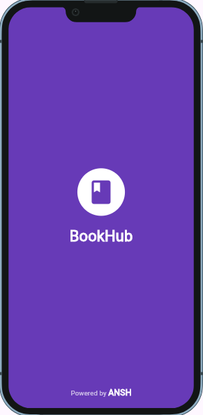
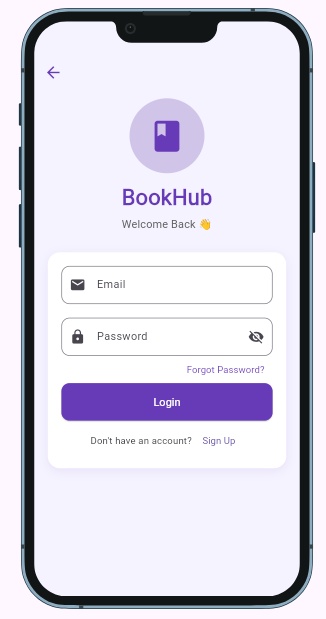
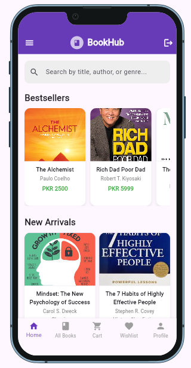
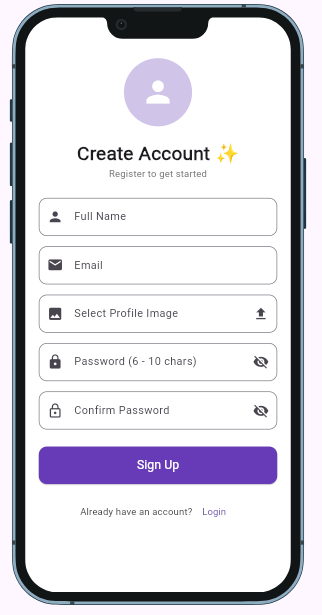
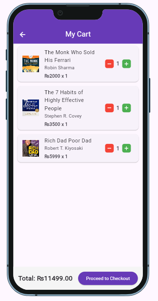
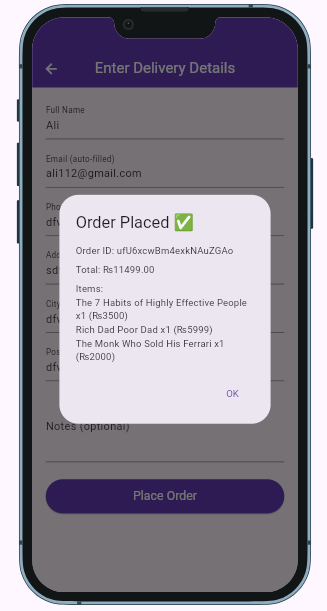

<div align="center">

# 📚 BookHub

### 🚀 Modern Flutter Firebase Book Store Application

<p align="center">


</p>

### 📖 A Complete Book Store Application built with Flutter & Firebase

BookHub is a feature-rich bookstore application that provides a smooth shopping experience for users and a powerful management dashboard for administrators.

Designed using **Flutter**, **Firebase**, **Cloud Firestore**, and **GetX**, this project demonstrates clean architecture, responsive UI, authentication, shopping cart, wishlist, reviews, and complete order management.

⭐ **If you like this project, don't forget to leave a Star!**

</div>

---

# ✨ Features

## 👤 Authentication

- Firebase Authentication
- User Registration
- Secure Login
- Logout
- Session Management
- Forgot Password
- Persistent Login

---

## 📚 Book Management

- Browse All Books
- Book Details
- Categories
- Genres
- Best Sellers
- New Arrivals
- Search Books
- Responsive Book Cards

---

## ❤️ Wishlist

- Add Books to Wishlist
- Remove Wishlist Items
- View Saved Books
- Real-time Updates

---

## 🛒 Shopping Cart

- Add to Cart
- Remove Items
- Quantity Management
- Live Price Calculation
- Checkout Summary

---

## 📦 Order System

- Order Form
- Place Orders
- Order Confirmation
- Order Summary
- Purchase History

---

## ⭐ Review System

- Write Reviews
- Display User Reviews
- Ratings Support

---

## 👨‍💼 Admin Panel

- Admin Dashboard
- Add New Books
- Edit Books
- Delete Books
- Manage Genres
- Manage Users
- Manage Orders
- View Customer Data

---

## 🎨 User Interface

- Beautiful Splash Screen
- Material Design 3
- Responsive Layout
- Smooth Navigation
- Professional UI
- Device Preview Support
- Loading Indicators
- Modern Cards

---

# 🛠 Tech Stack

| Technology | Description |
|------------|-------------|
| Flutter | Cross Platform UI Toolkit |
| Dart | Programming Language |
| Firebase Authentication | User Authentication |
| Cloud Firestore | NoSQL Cloud Database |
| Firebase Storage | Image Storage |
| GetX | State Management & Navigation |
| Material Design | UI Components |

---

# 📂 Project Highlights

✅ Firebase Authentication

✅ Cloud Firestore Integration

✅ Admin Dashboard

✅ Shopping Cart

✅ Wishlist

✅ Reviews

✅ Order Management

✅ Responsive UI

✅ Search Functionality

✅ Splash Screen

✅ Secure Authentication

✅ Clean Architecture

---

# 📂 Project Structure

```text
BookHub
│
├── android/
├── ios/
├── linux/
├── macos/
├── windows/
├── web/
│
├── assets/
│   ├── images/
│   ├── icons/
│   └── fonts/
│
├── lib/
│   ├── Admin/
│   ├── Users/
│   ├── Models/
│   ├── Widgets/
│   ├── Services/
│   ├── Utils/
│   ├── firebase_options.dart
│   └── main.dart
│
├── test/
├── pubspec.yaml
├── firebase.json
├── README.md
└── .gitignore
```

---

# 📱 Application Preview

> **Replace these images with your own screenshots after uploading them to the `screenshots` folder.**

## 🚀 Splash Screen

```text

```

---

## 🏠 Home Screen

```text

```

---

## 🔐 Login Screen

```text

```

---

## 📝 Signup Screen

```text

```

---

## 📖 Book Details

```text

```

---

## ❤️ Wishlist

```text


---

## 🛒 Shopping Cart

```text

```

---

## 📦 Checkout

```text

```

---

## 👨‍💼 Admin Dashboard

```text

```

---

# ⚙️ Installation Guide

## 1️⃣ Clone Repository

```bash
git clone https://github.com/Muhammad-Ali232/BookHub-Flutter-Firebase.git
```

---

## 2️⃣ Navigate to Project

```bash
cd BookHub-Flutter-Firebase
```

---

## 3️⃣ Install Dependencies

```bash
flutter pub get
```

---

## 4️⃣ Configure Firebase

Install FlutterFire CLI

```bash
dart pub global activate flutterfire_cli
```

Login

```bash
firebase login
```

Configure project

```bash
flutterfire configure
```

---

## 5️⃣ Run Application

Android

```bash
flutter run
```

Chrome

```bash
flutter run -d chrome
```

Windows

```bash
flutter run -d windows
```

---

# 🔥 Firebase Services

This application uses the following Firebase services.

✅ Firebase Authentication

✅ Cloud Firestore

✅ Firebase Storage

✅ Firebase Core

---

# 📦 Required Packages

- firebase_core
- firebase_auth
- cloud_firestore
- get
- device_preview
- image_picker
- intl
- flutter_rating_bar

---

# 🏗 Architecture

The application follows a clean and modular folder structure.

- Presentation Layer
- Business Logic Layer
- Firebase Service Layer
- Database Layer
- Authentication Layer

This architecture keeps the code organized, scalable, and easy to maintain.

---

# 🔐 Authentication Flow

```text
User
   │
   ▼
Login / Signup
   │
   ▼
Firebase Authentication
   │
   ▼
Cloud Firestore
   │
   ▼
Home Screen
```

---

# 📊 Firestore Collections

```text
users
admins
books
genres
wishlist
cart
orders
reviews
feedback
```

---

# 💡 Key Highlights

✔ Modern Flutter UI

✔ Firebase Backend

✔ Secure Authentication

✔ Real-time Firestore

✔ Wishlist Feature

✔ Shopping Cart

✔ Book Reviews

✔ Order Management

✔ Admin Dashboard

✔ Responsive Layout

✔ Clean Code Structure

---

# 🚀 Future Improvements

The following features are planned for future releases.

- 💳 Online Payment Gateway (Stripe / JazzCash / EasyPaisa)
- 🔔 Push Notifications
- 🌙 Dark Mode
- 🤖 AI Book Recommendation System
- 📑 PDF Invoice Generation
- ❤️ Favorite Authors
- 📚 Reading History
- 🎁 Discount Coupons
- 📍 Order Tracking
- 🌍 Multi-language Support
- ⭐ Advanced Ratings & Reviews
- 📈 Sales Analytics Dashboard
- 📱 Fully Responsive Tablet Layout
- 🔍 Advanced Filtering & Sorting

---

# 🧪 Testing

The application has been tested on:

- ✅ Android
- ✅ Chrome (Flutter Web)
- ✅ Windows Desktop

---

# 🔒 Security Features

- Firebase Authentication
- Firestore Security Rules
- User Session Management
- Secure Navigation
- Protected Admin Access
- Form Validation
- Error Handling

---

# ⚡ Performance Optimizations

- Efficient Firestore Queries
- Optimized Widget Rebuilds
- Lazy List Rendering
- Cached Image Rendering
- Responsive Layout
- Clean Folder Structure

---

# 🤝 Contributing

Contributions are welcome!

If you'd like to improve this project:

1. Fork the repository.
2. Create a new branch.
3. Commit your changes.
4. Push your branch.
5. Open a Pull Request.

---

# 🐛 Report Issues

If you find any bugs or have suggestions, please open an Issue in this repository.

Your feedback is always appreciated.

---

# 📌 Repository Topics

```
flutter
dart
firebase
cloud-firestore
firebase-auth
mobile-app
bookstore
shopping-cart
wishlist
admin-panel
getx
```

---

# 👨‍💻 Developer

## Muhammad Ali

**Flutter & MERN Stack Developer**

I enjoy building modern, responsive and scalable applications using Flutter, Firebase, React, Node.js, Express.js and MongoDB.

### 💼 Technical Skills

- Flutter
- Dart
- Firebase
- Cloud Firestore
- Firebase Authentication
- GetX
- REST APIs
- React.js
- Node.js
- Express.js
- MongoDB
- HTML5
- CSS3
- Bootstrap
- JavaScript

---

# 🌐 Connect With Me

### GitHub

https://github.com/Muhammad-Ali232

---

# ⭐ Support

If you found this project useful:

⭐ Star this repository

🍴 Fork this repository

💡 Share your feedback

Your support helps me continue building quality open-source projects.

---

# 📄 License

This project is provided for learning and portfolio purposes.

You are welcome to explore, modify and extend it for educational use.

---

# 🙏 Acknowledgements

Special thanks to:

- Flutter Team
- Firebase Team
- Dart Team
- Open Source Community

---

<div align="center">

# 📚 BookHub

### Built with Flutter ❤️ Firebase

### Developed by Muhammad Ali

⭐ **If you enjoyed this project, please consider giving it a Star!** ⭐


<br><br>

**Happy Coding! 🚀**

</div>
